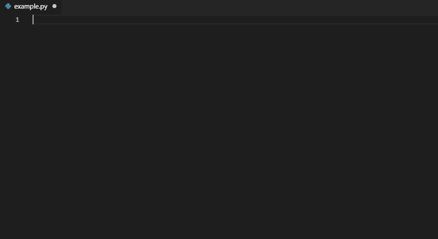

# PyTorch Code Snippets for VSCode

[](https://marketplace.visualstudio.com/items?itemName=SBSnippets.pytorch-snippets)
[](https://marketplace.visualstudio.com/items?itemName=SBSnippets.pytorch-snippets)
[](https://marketplace.visualstudio.com/items?itemName=SBSnippets.pytorch-snippets)
[](LICENSE.md)
[](https://github.com/SvenBecker/vscode-pytorch/releases)

This project aims to provide a faster workflow when using the [PyTorch](https://github.com/pytorch/pytorch) or [torchvision](https://github.com/pytorch/vision) library in [Visual Studio Code](https://code.visualstudio.com/).
This extension provides code snippets for often used coding blocks as well as code example provided by the libraries for common deep learning tasks.

## Table of Contents

1. [Getting Started](#usage)
2. [Dependencies](#dependencies)
3. [Installation](#installation)
4. [Changelog](#changelog)
5. [Get Involved](#involved)
    1. [Contributing](#contributing)
    2. [Future Plans](#plans)
    3. [Contact](#contact)
6. [Credits](#credits)

## <a name="usage" > </a> Getting Started

If this extension is installed and activated you might notice by start typing `pytorch` in your python file a dropdown list appears. Entries starting with `pytorch:` represent code snippets refering to those libraries offered by this extension.
Snippets appear in the same way as code completion by using `Ctrl+Space`. There are _placeholders_, _variables_ and _choices_ defined inside the code snippets so you can jump from one to another just by pressing `Tab`. Examples on how to use this extension are shown below. For a full overview please take a look at the [Snippet Collection](COLLECTIONS.md).

### <a name="pytorch" > </a> PyTorch Preview



## <a name="dependencies" > </a> Dependencies

Currently the snippets are working for the latest releases of the supported libraries:

* pytorch >= 1.1.0
* torchvision >= 0.3.0

>__Note__:
>Be aware that the pytorch or torchvisionlibarary might change and the presented snippets might become outdated in some areas. But overall for the most functions it should still be fine. I don't expect major changes regarding naming conventions etc..

## <a name="installation" > </a> Installation

The installation process is very straightforward. The recommend, stable way is as follows:

1. Launch Visual Studio Code
2. From the command palette `Ctrl-Shift-P` (Windows, Linux) or `Cmd-Shift-P` (MacOS) select `Install Extension` or just simply go to the `Extensions` tab (most likely the fifth entry on the left sidebar). You can also use the hotkey `Ctrl-Shift-X` respectifely `Cmd-Shift-X`
3. Type `PyTorch Snippets`
4. Choose and install extension
5. Restart/Reload Visual Studio Code

This will give you the most recent version you can find on the [VS Marketplace](https://marketplace.visualstudio.com/vscode).
Alternatively you can also clone this repository and move it manually into your VS Code extension folder which will give you
the most recent version on GitHub.

```sh
git clone https://github.com/SvenBecker/vscode-pytorch.git
mv vscode-pytorch /path/to/your/VSCodeExtensionFolder/
```

On Windows for example you can normally find the extension folder at `C:\Users\YourName\.vscode\extensions`. On MacOS and Linux it should be located at `~/.vscode/extensions`.

> __Note__: The second method will give you the overall most recent version because I won't update the VS Marketplace version as often
> as the GitHub version but the VS Marketplace version will probably be the more stable one.

## <a name="changelog" > </a> Changelog

#### [1.0.0] - 2019-07-25

##### Added

- Added `pytorch:scheduler` snippets for learning rate scheduling
- Added torchvision dataset and model snippets `pytorch:torchvision:...`
- Added model loading from checkpoint or github repo `pytorch:checkpoint`, `pytorch:github`
- Added sampler snippets `pytorch:sampler`

##### Changed

- Snippets for Ignite and Fastai have been moved to seperate projects. Soo you can find them at github.com/svenbecker/vscode_fastai and github.com/svenbecker/vscode_ignite. This war primarily done to reduce the snippet overload
- `pytorch:sequential` has been moved to `pytorch:container`
- Updated official `pytorch:examples`

#### Version 0.2.3:

##### Added

- Added two new snippets `pytorch:dataset` and `ignite_metrics`

#### Version 0.2.2:

##### Added

- Added DataBlock API support for tabular data `fastai:tabular:datablock`

##### Changed

- Changed `train` snippets for PyTorch and fastai

##### Fixed

- Fixed bugs in optimizer selection

#### Version 0.2.1:

##### Added

- Added PyTorch Functional Snippets `pytorch:F:`

#### Version 0.2.0:

##### Added

- Added code snippets for fast metrics or loss selection (PyTorch and fastai)
- Added easy selection of neural network layers in PyTorch based on their type `pytorch:layer:` (conv, recurrent, etc.)
- Added some more PyTorch snippets like for example optimizer selection, weight initialization etc.
- Added DataBlock API snippets for fastai

##### Changes

- Changed some code examples for common problems to be inline with the official examples provided by PyTorch
  
All of the past as well as the upcoming changes can further be viewed at [Changelog](CHANGELOG.md).

## <a name="involved" > </a> Get Involved

### <a name="contributing" > </a> Contributing

If you want to contribute, what I would highly appreciate since this project is currently in a very early stage
and there is still so much to do, please take a look at [Contributing](CONTRIBUTING.md).

### <a name="plans" > </a> Future Plans

Furthermore I would like to offer VS Code snippets for visualization in Python, like for
example [Matplotlib](https://matplotlib.org/api/pyplot_api.html) or [Seaborn](https://seaborn.pydata.org/). Eventually even considering the inclusion of interactive visualization libraries like [Bokeh](https://bokeh.pydata.org/en/latest/) or [Plotly](https://plot.ly/). If anyone is interested in this kind of project and/or want to offer some help please
[contact](#contact) me.

### <a name="contact" > </a> Contact

Suggestions for improvements will be highly appreciated. You can write me an email (address is provided on my [profile](https://github.com/SvenBecker)) or you can contact me via Twitter [@SBX9209](https://twitter.com/SBX9209).

## <a name="credits" > </a> Credits

* [PyTorch](https://pytorch.org/): A huge thanks to the PyTorch team for building such an awesome, easy to use deep learning framework and for offering a numerous amount of code examples.
* [VSCode](https://code.visualstudio.com/): My personal favorite text editor and I'm grateful for all the options they are offering, like a huge amount of language support, extensions, integrated terminal, debugger etc..
